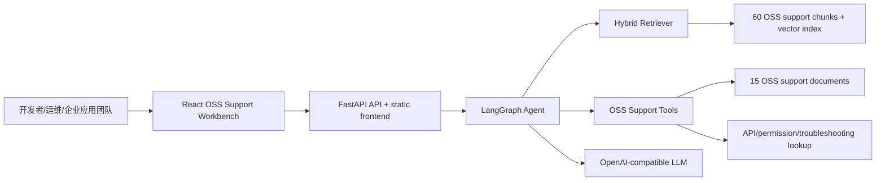
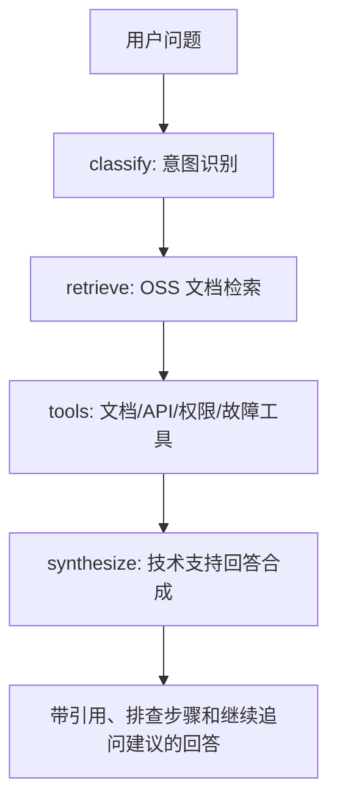

# Architecture Spec

## 总体架构

## Agent 流程

## 关键设计

- 检索器采用 Embedding 向量相似度 + BM25 的混合召回；当 `.env` 未配置 Embedding 时自动回退到 BM25，保证演示可运行。
- LangGraph 将意图识别、检索、工具调用、回答合成拆成显式节点。
- 工具调用包含 `doc_lookup`、`api_lookup`、`permission_lookup`、`troubleshoot_lookup`、`cost_lookup` 和 `topic_lookup`。
- 每份 OSS 支持文档拆分为概览、操作步骤、权限说明、API 参考、故障排查、成本优化等 chunk。
- RAG 知识库只包含 OSS 技术支持知识和官方来源 URL；课程要求、项目说明和报告文本不进入检索数据。
- React 页面由 FastAPI 托管，正式演示只需要启动一个后端进程并访问 `http://127.0.0.1:8000`。
- `/ask/stream` 以 SSE 发送 `status`、`meta`、`token`、`final` 和 `done` 事件，Web 页面据此展示生成状态和逐 token 回答。
- 引用结果包含 chunk id、来源、检索分数、文档分类和片段摘要，Web 端展示“知识库依据”区域，让用户确认回答来自本地 OSS 文档知识库。
- LLM 层读取 `.env` 中的 `BASE_URL`、`API_KEY`、`MODEL` 三项，连接 OpenAI 兼容 Chat Completions API；Embedding 层读取 `EMBEDDING_BASE_URL`、`EMBEDDING_API_KEY`、`EMBEDDING_MODEL`，连接 OpenAI 兼容 Embeddings API。

## 可扩展性

- 可接入阿里云更多产品文档，例如 ECS、RAM、CDN、SLB、RDS。
- 可加入真实文档爬取和增量更新任务，通过 URL 清单或官方文档导出生成知识库。
- 可扩展多智能体：权限 Agent、故障排查 Agent、API Agent 和成本优化 Agent，由总控 Agent 汇总回答。
